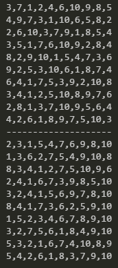

ES6

## let const

```js
let arr = [1, 1, 2]
for (let i = 0; i < arr.length; i++) {
  const item = arr[i];
  console.log(item);
}
```

## 箭头函数

```js
let testFn = () => {
  console.log(this);
}
```

## 字符串

```js
let num = 1
let str = `this num is ${num}`
```

## 解构

```js
let [item1, item2] = [2, 3]
let {name, age} = { name: 'name 1', age: 2 }
```

## 模块

```js
function add(num1, num2) {
  return num1 + num2
}

export { add };
```

## 参数默认值

```js
function add(num1, num2 = 2) {
  return num1 + num2
}
```

## 不定数目参数

```js
function add(num1, ...args) {
  let numAll = num1
  for (let arg of args) {
    numAll += arg
  }
  return numAll
}
```

## 展开操作

```js
let [...arr] = [2, 3]
console.log(arr)
```

## 类

```js
class User {
  constructor(name, age) {
    this.name = name
    this.age = age
  }

  addAge() {
    this.age += 1
  }
}
```

## Promises

```js
const sleep = (time) => {
  return new Promise((resolve, reject) => {
      setTimeout(() => {
        console.log('sleep ok')
        resolve('ok')
      }, time)
  })
}
sleep(3000).then(() => {
  console.log('then')
})
```

## Generators

```js
function* testFn () {
  let arr = [1, 3, 5]
  for (let i = 0; i < arr.length; i++) {
    yield arr[i]
  }
  console.log('testFn')
}
let test = testFn()
console.log(test.next())
console.log(test.next())
console.log(test.next())
console.log(test.next())
```

* js 笔记

``` js
// 常用 log 方法
let log = (obj) => {
  let str = typeof obj === 'object' ? JSON.stringify(obj, null, 2) : obj
  console.log(str)
}

//- const 定义 常量
//- 如果const的是一个对象，对象所包含的值是可以被修改的。抽象一点儿说，就是对象所指向的地址没有变就行

let _aa = {}
const _bb = _aa
_aa.name = 'xx'
_aa  = { name: 'yy' }
log(_bb)

//- {}大括号内的代码块即为let 和 const的作用域

var funcs = []
for (let i = 0; i < 10; i++) {
  funcs.push(function () {
    log(i)
  })
}
funcs.forEach(function (func) {
  func()
})

const tpl = `
  <p>
    <span>hello world</span>
  </p>
`
log(`<div>${tpl}</div>`)

//- ES6为参数提供了默认值

function action(num = 10) {
  log(num)
}
action(0)
action()
action(30)

//- map 方法 不改变原始数组
let _arr = [
  {
    name: 1
  },
  {
    name: 2
  },
  {
    name: 3
  }
]
let _arr2 = _arr.map(x => x.name + 1)
log(_arr)
log(_arr2)

//- filter 方法 过滤数组 不改变原始数组
let _arr3 = _arr.filter(x => x.name > 2)
log(_arr)
log(_arr3)

function people (name, age) {
  return {
      name,
      age
  }
}
log(people('aa', 12))

//- objC 源对象被改变 Object.assign 返回 objC 源对象
const objA = { n: 'nn' }
const objB = { a: 'aa' }
const objC = {}
const obj = Object.assign(objC, objA, objB)
log(objA)
log(objB)
log(objC)
log(obj)
log(obj === objC)

//- 数组
const number = [1, 2, 3, 4, 5]
const [f, s, ...R] = number
log(R)
//- err: rest 元素必须是最后一个元素
const [...R2, l1, l2] = number
log(R2)

//- 1.当用export default people导出时，就用 import people 导入（不带大括号）
//- 2.一个文件里，有且只能有一个export default。但可以有多个export。
//- 3.当用export name 时，就用import { name }导入（记得带上大括号）
//- 4.当一个文件里，既有一个export default people, 又有多个export name 或者 export age时，导入就用 import people, { name, age }
//- 5.当一个文件里出现n多个 export 导出很多模块，导入时除了一个一个导入，也可以用import * as example

setTimeout(function() {
  console.log(1)
}, 0)
new Promise(function executor (resolve, reject) {
  console.log(2)
  for( var i=0 ; i<10000 ; i++ ) {
    i == 9999 && resolve()
  }
  console.log(3)
}).then(function () {
  console.log(4)
})
console.log(5)
//- 2 3 5 4 1

for (var i = 0; i < 5; i++) {
  console.log(i)
}
for (var i = 0; i < 5; i++) {
  log(i)
}
for (var i = 0; i < 5; i++) {
  setTimeout(function() {
    console.log(i)
  }, 1000 * i)
}
for (var i = 0; i < 5; i++) {
  (function (i) {
    setTimeout(function () {
      console.log(i)
    }, i * 1000)
  })(i)
}

//- macro-task: script (整体代码)，setTimeout, setInterval, setImmediate, I/O, UI rendering.
//- micro-task: process.nextTick, Promise(原生)，Object.observe，MutationObserver
//- 除了script整体代码，micro-task的任务优先级高于macro-task的任务优先级。
//- 其中，script(整体代码) ，可以理解为待执行的所有代码
setImmediate(function (){
  log(1)
}, 0)
setTimeout(function (){
  log(2)
}, 0)
new Promise(function (resolve, reject){
  log(3)
  resolve()
  log(4)
}).then(function (){
  log(5)
})
log(6)
process.nextTick(function (){
  log(7)
})
log(8)
//- 输出结果是3 4 6 8 7 5 2 1

let fnA = function () {
  return fnB();
}
let fnB = function () {
  let fnC = () => {
    fnC 堆栈
    log('fnC 函数')
  }
  setTimeout(() => {
    setTimeout 堆栈
    log('匿名 函数')
  }, 0)
  setTimeout(() => {
    fnC()
  }, 0)
}
fnA()

//- 使用「对象解构」 取数组中指定项
const csvFileLine = '1997,John Doe,US,john@doe.com,New York'
const { 2: country, 4: state } = csvFileLine.split(',')
log({ 2: country, 4: state })

//- 数组去重 undefined 会转成 null
const removeDuplicateItems = arr => [...new Set(arr)];
const _arr = removeDuplicateItems([42, 'foo', 42, 'foo', true, true, 0, 0, undefined, undefined, null, null, false, false]);
log(_arr)

//- 二维数组降维
const arr = [11, [22, 33], [44, 55], 66];
const _arr = [].concat(...arr)
log(_arr)

// 生成随机数
let r_fn = (min, max) => {
  let R = Math.floor(Math.random() * (max - min)) + min
  return R
}
// 将数组随机 排序
let random_arr_fn = (_arr) => {
  let _arr2 = []
  // 生成随机数
  let r_fn = (min, max) => {
    let R = Math.floor(Math.random() * (max - min)) + min
    return R
  }
  let L = _arr.length
  for (let i = 0; i < L; i++) {
    let k = r_fn(0, L - i)
    _arr2.push(_arr.splice(k, 1)[0])
  }
  log(_arr2.toString())
  return _arr2
}
for (let i = 0; i < 10; i++) {
  random_arr_fn([1,2,3,4,5,6,7,8,9,10])
}
// 将数组随机 sort 快速排序 (最后一位 出现重复位置[最后一位 或 第一位] 概率较大)
let random_arr_fn = (_arr) => {
  let _arr2 = []
  _arr2 = _arr.sort(() => {
    return Math.random() > 0.5 ? -1 : 1
  })
  log(_arr2.toString())
  return _arr2
}
for (let i = 0; i < 10; i++) {
  random_arr_fn([1,2,3,4,5,6,7,8,9,10])
}
```

